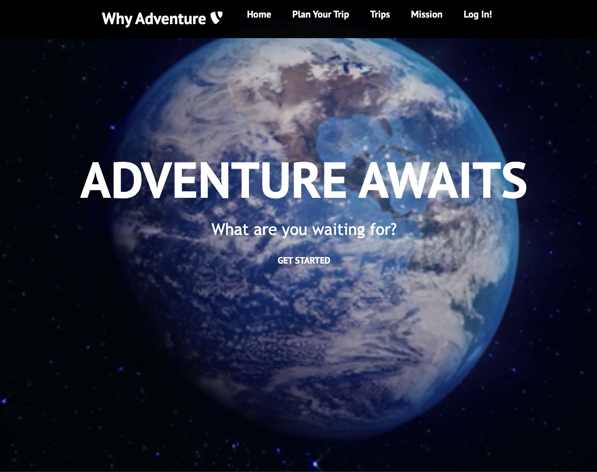
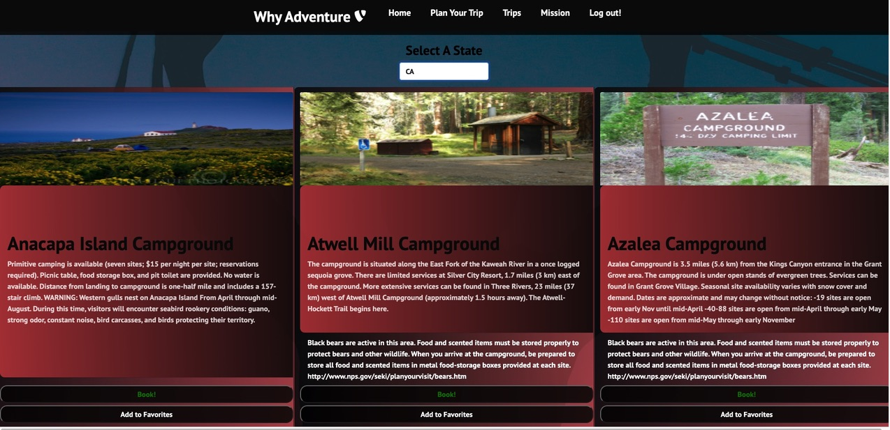
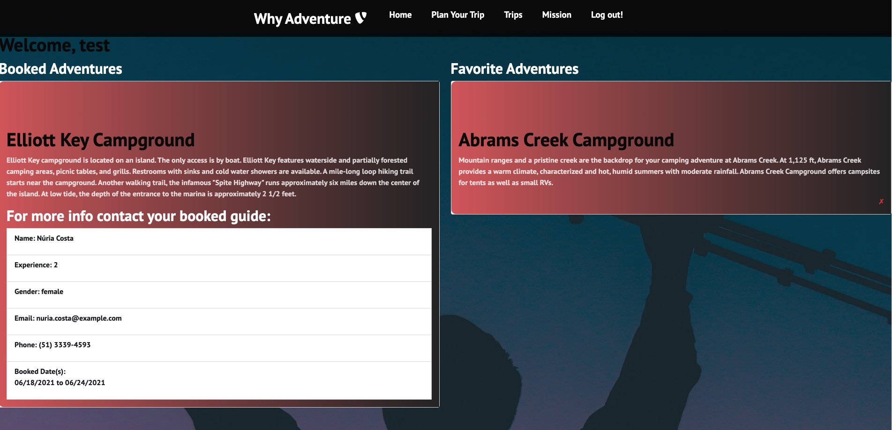
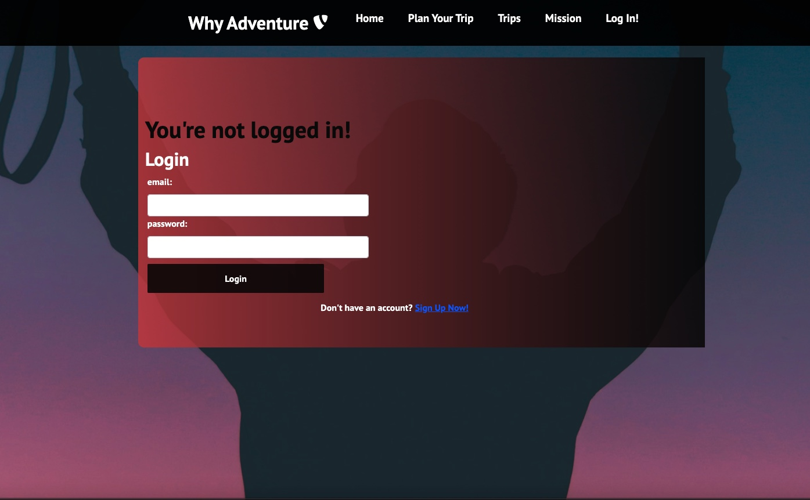

# Project-Why-Adventure

## Table of Contents

* [About-project](#Description)
* [Images](#Images)
* [Instalation](#Instalation)
* [Project Requirements](#Project-Requirements)
* [Contributor](#Contributor)
* [Email-adress](#Email)
* [GitHub-profile](#GitHub-profile)
* [Heroku](#Heroku)

   
### About the project:

WHY ADVENTURE is an app for travelers who want a more unique,
local experience in their next holiday or getaway.
Within the application, you can browse destinations
and view pertinent travel information. Once you know where you want to go
it is time to pick your dates, and move on to guide selection. 
The platform creates an easy interface for users to connect
with locals where they’d like to go.

This app is a React based app with a MondoDB. 

Libraries
* Bootstrap
* Moment.js
* DateRangePicker
* Axios
* Concurrently
* Nodemon
* If-env
* Bcrypt

### Images:
Homepage:
 
Plan Your Trip page:
 
Trips page:
 
Login page:
 

### Instalation:
* In the console run - npm install
* In the console run - npm start

### Project Requirements:

* Expectations
* Have utility
* Market or real-world research that evidences your idea has REAL value to people
* Do research on other web/mobile apps in your domain
* Serious time and thought into this
* Report problems you are facing along the way
* Utilize some form of a project management system
* Dig deep into documentation and external resources to learn what you need
* Took a screenshot of the req, they're also below
* Must use ReactJS
* Must use Node and Express Web Server
* Must be back by MongoDB or SQL database with a Sequelize or Mongoose ORM
* Deployed using Heroku
* GET and POST routes
* Two libraires, packages or technologies we have not used
* Must allow for or involve authentication of users in some way
* Polished front end/UI
* Folder structure that meets MVC paradigm
* Good quality coding standards (indentation, scoping, naming)
* Must not expose sensitive API key info on the server

### Contributor:
* Matache Marius
* Conor O'Brien
* Shayla Stevenson
* Jon Ekes
* Sandu Corobcenco

### Email adress:
* matachemarius92@gmail.com
* jrekse@gmail.com
* shaylarose11@gmail.com
* obrienceob@gmail.com
* corobcenco.sandu@gmail.com

### GitHub profile:
* https://github.com/MatacheMarius
* https://github.com/obrienceob
* https://github.com/ShaylaStevenson
* https://github.com/Jrekse
* https://github.com/SanduCorobcenco

### GitHub Repo
* https://github.com/MatacheMarius/Project-Why-Adventure
### Heroku:
* https://boiling-garden-68893.herokuapp.com/

